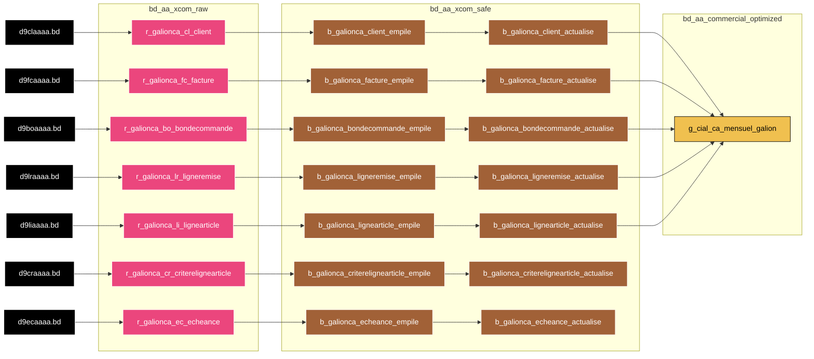

# bdl-bscc-galionca
Les différentes directions ou BU cherchent à avoir une vision 360° du CA réalisé par le groupe la Poste et ses filiales. De ce fait, dans l'outil de pilotage de la BSCC, il nous faut intégrer les chiffres d'affaires réalisés par l'outil de facturation Grand Large, bientôt remplacé dans le cadre du projet Paktole nouvellement Factura. 
Ce fichier transmis quotidiennement les 7 premiers jours ouvrés du moiss puis tous les mardis et vendredis par Galion nous permet d'avoir la visibilité sur le CA réalisé le mois précédent par un client. Afin de réussir à avoir cette vue 360°.

# Liens
* **MIS** : https://wiki.net.extra.laposte.fr/confluence/display/BGDL/MIS+galionca
* **DEX** : https://wiki.net.extra.laposte.fr/confluence/display/BGDL/DEX+galionca

# FlowChart

> **Légende**
> * **Trait plein** : Ce flux transporte les données principales, relatives au 'coeur de Métier' de l'application
> * **Trait pointillé** : Ce flux transporte des données secondaires, moins importantes et principalement utilisées lors jointure/union/...
> * **Doubles bordures verticales** : Cette table est partitionnée

# Historique des évolutions fonctionnelles et techniques
| Date de MEP | Version  | Jira                                                               | Description                                                |
|-------------|----------|--------------------------------------------------------------------|------------------------------------------------------------|
| 2023-03-07  | 02_00_00 | [BDL-663](https://jira.net.extra.laposte.fr/jira/browse/BDL-663)   | Première MEP                                               |
| 2023-05-16  | 02_00_01 | [BDL-1023](https://jira.net.extra.laposte.fr/jira/browse/BDL-1023) | Ajout condition de jointure                                |
| 2023-06-01  | 02_00_02 | [BDL-1091](https://jira.net.extra.laposte.fr/jira/browse/BDL-1091) | Empile - maj decimal replace virgule to point              |
| 2023-06-01  | 02_00_03 | [BDL-1097](https://jira.net.extra.laposte.fr/jira/browse/BDL-1097) | Encodage des fichiers                                      |

# Notes
Aucune donnée à caractère personnel n'est recensée dans ce flux . 
 
Volumétrie du fichier mensuel : 20 lignes 
Volumétrie de la table à 1 an : 60 Ko/an 
Nombre de colonnes dans la tableau :  2+1 
Autre :

# TODO List
*
